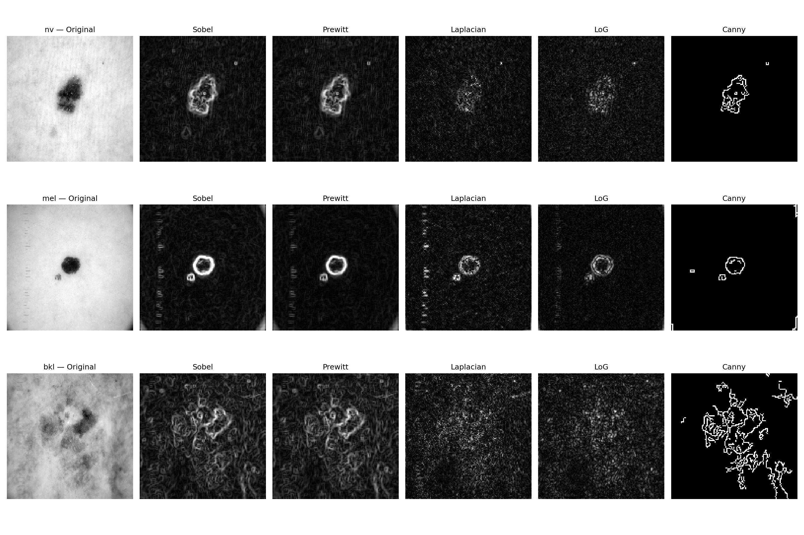
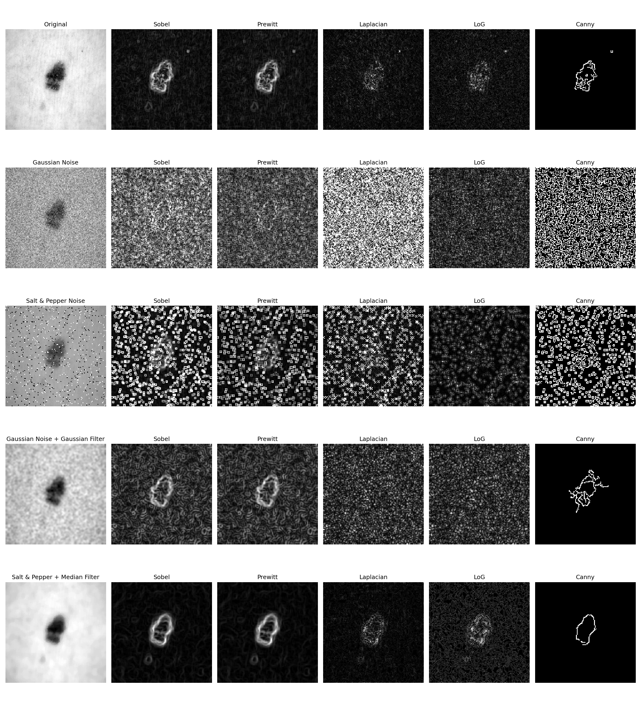
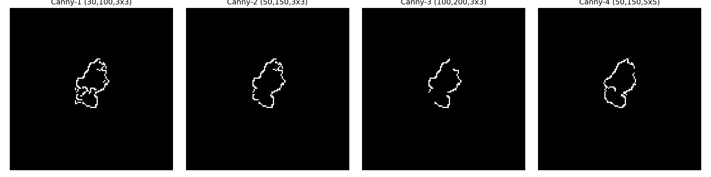
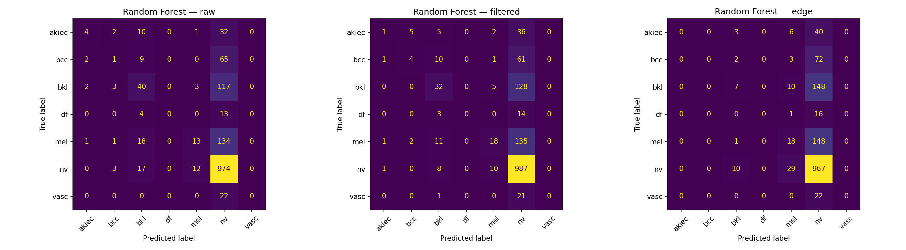
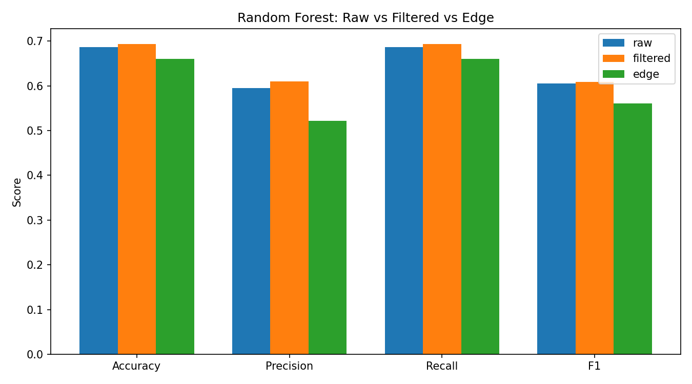

# Edge Detection Techniques and Their Impact on Classification — HAM10000

Third lab in the same series as Lab01 and Lab02. Here I moved from raw/filtered images to edge maps and checked what classical edge detectors actually do to a skin lesion image, how bad they get once noise is added, how Canny's thresholds change what gets detected, and finally whether feeding a model edges instead of the real image helps or hurts classification.

> Educational lab work — not a diagnostic tool.

**Dataset:** [HAM10000 (Skin Cancer MNIST)](https://www.kaggle.com/datasets/kmader/skin-cancer-mnist-ham10000)
**Notebook:** [`CV_SkinLesion_EdgeDetection.ipynb`](./CV_SkinLesion_EdgeDetection.ipynb)
**Results folder:** [`assets/`](./assets) — all saved figures and CSV tables from the actual run
**Previous labs:** [Lab01](../../Lab01/Skin-Lesion-Classification), [Lab02](../../Lab02/Skin-Lesion-Filtering-Effect)

---

## What's in this lab

| Task | What I did |
|---|---|
| 1 | Ran Sobel, Prewitt, Laplacian, LoG and Canny on sample images from 3 classes (`nv`, `mel`, `bkl`) |
| 2 | Added Gaussian noise and salt-and-pepper noise, then tried Gaussian/Median filtering before edge detection |
| 3 | Tested 4 Canny configurations (different low/high thresholds + one bigger kernel) |
| 4–5 | Built raw, filtered and edge versions of the dataset and trained SVM, Random Forest, KNN and a small CNN on each |
| 6 | Confusion matrices and a metric comparison for whichever model came out on top |

Same train/val/test split as Lab02, same 7 HAM10000 classes (`akiec, bcc, bkl, df, mel, nv, vasc`), 128×128 grayscale.

---

## Setup

- Edge detectors: OpenCV `Sobel`, a manual Prewitt kernel through `filter2D`, `Laplacian`, LoG (Gaussian blur then Laplacian), `Canny`.
- Noise: Gaussian (σ = 25) and salt-and-pepper (p = 0.05), added with NumPy.
- Preprocessing before re-running edge detection: Gaussian blur (5×5) for the Gaussian-noise case, median filter (5×5) for the salt-and-pepper case.
- Canny thresholds tried: (30,100), (50,150), (100,200), plus (50,150) again with a 5×5 kernel instead of 3×3.
- Classification datasets, all from the same split:
  - Raw — plain grayscale, resized.
  - Filtered — Gaussian blur applied (carried over from Lab02).
  - Edge — Canny output using whichever config I picked as best in Task 3.
- Models: SVM, Random Forest, KNN on flattened pixel vectors (resized to 32×32 for speed, capped at 2500 training samples so it didn't take forever), and a 3-conv-layer CNN trained on the full 128×128 images for 5 epochs, same for all three variants.

---

## Task 1 — Comparative Edge Detection

Sobel and Prewitt basically look identical here, which matches what I expected — Prewitt just weighs the kernel a bit differently, it doesn't change much visually. Laplacian and LoG pick up a lot of grainy noise around the lesion outline, especially on the `bkl` row where there's a lot of skin texture in the background. Canny is the only one that gives a clean, thin, closed-ish boundary for all three classes — on `mel` it even separates the small dark spot next to the main lesion as its own loop.

## Task 2 — Effect of Noise and Preprocessing

### Table 1 — Effect of Noise and Preprocessing on Edge Detection

| Edge Detector | Input | Noise | Preprocessing | Edge Density | Observation |
|---|---|---|---|---|---|
| Sobel | Original | None | None | 0.9952 | Very high — background texture alone gives a small nonzero gradient almost everywhere |
| Sobel | Noisy | Gaussian | None | 0.9995 | Basically saturated, gradient magnitude is nonzero at nearly every pixel |
| Sobel | Noisy | Salt & Pepper | None | 0.9963 | Similar, S&P spikes add to an already-high baseline |
| Sobel | Noisy | Gaussian | Gaussian Filter | 0.9987 | Barely moves — smoothing doesn't zero out low-level gradient response |
| Sobel | Noisy | Salt & Pepper | Median Filter | 0.9427 | Noticeably lower — median filter is the only one that actually flattens large patches to zero gradient |
| Prewitt | Original | None | None | 0.9963 | Same pattern as Sobel |
| Laplacian | Original | None | None | 0.9598 | High, but lower than Sobel/Prewitt |
| LoG | Noisy | Gaussian | Gaussian Filter | 0.9106 | Lowest of the gradient-based group, the pre-blur does help here |
| Canny | Original | None | Built-in smoothing | 0.0137 | Completely different scale — Canny thresholds out the weak background response |
| Canny | Noisy | Gaussian | Gaussian Filter | 0.0182 | Slightly higher than clean original, some noise still gets through as edge pixels |
| Canny | Noisy | Salt & Pepper | Median Filter | 0.0073 | Lowest of all — median filtering plus hysteresis thresholding is a strong combo |

*(Edge Density = fraction of pixels marked as "edge" by that detector, i.e. `mean(edge_image > 0)`. For Sobel/Prewitt/Laplacian/LoG this counts any pixel with a nonzero gradient magnitude after `convertScaleAbs`, which on real dermoscopy images — hair, ruler marks, skin texture — is almost the whole frame. That's why those numbers sit near 1.0 while Canny, which applies its own threshold + non-max suppression, stays in the 0.01–0.02 range. I didn't expect the gap to be this big before running it, but it makes sense once you look at what each method actually outputs — Canny gives a binary "edge or not" map, the others give a continuous gradient map where I'm just counting anything above zero.)*

**What I noticed:**
- **Continuity:** Canny is clearly the most continuous/clean boundary across every row in Task 2's figure. Sobel/Prewitt on the salt-and-pepper row turn into a grid of little squares — you can barely see the lesion shape under the noise.
- **Sharpness:** Laplacian/LoG stay thin even under noise, but the noise itself dominates the image so the "sharp" edges are mostly false positives, not the real boundary.
- **False edges:** worst case by far is Sobel/Prewitt/Laplacian on raw salt-and-pepper input — every isolated black/white pixel becomes its own little edge blob.
- **Broken edges:** happens to all the first-order detectors under salt-and-pepper noise until the median filter is applied; after median filtering, Canny goes back to a clean closed loop.
- **Smoothing match matters:** Gaussian filter helps with Gaussian noise, median filter helps with salt-and-pepper — using the "wrong" filter (which I didn't formally test here, just observed from the pairs I did run) would leave one type of noise mostly untouched.

## Task 3 — Canny Parameter Analysis

### Table 2 — Canny Parameter Analysis

| Configuration | Low | High | Kernel | Detected Edge Pixels | Observation |
|---|---|---|---|---|---|
| Canny-1 | 30 | 100 | 3×3 | 169 | Most pixels detected, boundary looks slightly thicker/rougher, a bit of extra detail inside the lesion |
| Canny-2 | 50 | 150 | 3×3 | 131 | Clean single closed loop, matches the visible lesion outline well — **picked this as best** |
| Canny-3 | 100 | 200 | 3×3 | 102 | Fewest pixels, boundary starts breaking in a couple of spots on the right side |
| Canny-4 | 50 | 150 | 5×5 | 130 | Almost same count as Canny-2 but the bigger blur kernel rounds off some corners of the shape |

**Picked configuration:** Canny-2 (Low = 50, High = 150, 3×3 kernel). It sits in between the other two threshold pairs and gives the most complete, least broken outline out of all four — Canny-1 adds detail I don't think is useful for classification, Canny-3 loses part of the boundary.

## Tasks 4–5 — Classification on Raw / Filtered / Edge

### Table 3 — Classification Performance Comparison

| Model | Variant | Accuracy | Precision | Recall | F1-Score | Train Time (s) | Inference Time (ms/img) |
|---|---|---|---|---|---|---|---|
| SVM | Raw | 0.678 | 0.581 | 0.678 | 0.599 | 4.70 | 1.500 |
| SVM | Filtered | 0.675 | 0.579 | 0.675 | 0.593 | 4.13 | 0.809 |
| SVM | Edge | 0.599 | 0.546 | 0.599 | 0.569 | 3.95 | 1.138 |
| Random Forest | Raw | 0.687 | 0.595 | 0.687 | 0.606 | 8.37 | 0.052 |
| Random Forest | Filtered | 0.693 | 0.611 | 0.693 | 0.609 | 9.41 | 0.038 |
| Random Forest | Edge | 0.660 | 0.521 | 0.660 | 0.560 | 3.27 | 0.051 |
| KNN | Raw | 0.662 | 0.572 | 0.662 | 0.592 | 0.00 | 0.267 |
| KNN | Filtered | 0.668 | 0.584 | 0.668 | 0.599 | 0.00 | 0.201 |
| KNN | Edge | 0.655 | 0.513 | 0.655 | 0.547 | 0.00 | 0.203 |
| CNN | Raw | 0.687 | 0.599 | 0.687 | 0.605 | 826.03 | 13.985 |
| CNN | Filtered | 0.688 | 0.583 | 0.688 | 0.606 | 797.26 | 12.510 |
| CNN | Edge | 0.663 | 0.567 | 0.663 | 0.596 | 794.69 | 14.383 |

**Best model overall (by mean accuracy across the three variants): Random Forest** (≈0.680 average, CNN came in right behind it at ≈0.679 — basically tied, but Random Forest edged it out and trained in seconds instead of minutes).

One thing I have to be honest about — none of these numbers look great in absolute terms, and precision especially drops on the Edge column for every model. Looking at the Random Forest confusion matrix (below) explains why: the dataset is dominated by the `nv` class, and the model is mostly just learning to predict `nv` a lot of the time. On raw images it still gets the small classes (`df`, `vasc`) essentially zero correct, and on the edge dataset that gets even worse — `akiec` and `bcc` drop to 0 correct predictions entirely. So accuracy staying around 0.65–0.69 across the board is partly the class imbalance carrying the score, not the model actually learning to tell every class apart.

## Task 6 — Visual Comparison (Random Forest)

The three confusion matrices line up with what the accuracy table already suggested: `nv` is predicted correctly almost every time (974/987/967 out of roughly 1000+ true `nv` samples across raw/filtered/edge), while `df` and `vasc` get 0 correct predictions in every single variant. On the Edge matrix specifically, `akiec` and `bcc` also collapse to 0 correct — on raw images the model at least got a handful right (4 and 1 respectively). Everything that isn't `nv` gets swallowed into the `nv` column once the input is reduced to edges only.

The bar chart makes the same point more directly — Raw and Filtered track each other closely on all four metrics, Edge is lower on every single one, and the gap is biggest on Precision (0.61 filtered vs 0.52 edge). Recall barely moves between the three because it's dominated by how well `nv` gets picked up, which stays high regardless of input type.

---

## Discussion Questions

**Q1 — Edge Detection and Noise**
Going purely off Task 2's noise-density numbers and the figure, Laplacian was the most affected by noise visually — the Gaussian-noise row for Laplacian is almost pure white static, you can't make out the lesion shape at all. It's a second derivative, so it reacts to every small pixel-to-pixel jump, and random noise is exactly that. Sobel and Prewitt hold up slightly better since they only take one derivative, but they still get overwhelmed under salt-and-pepper noise until a median filter is applied first.

**Q2 — Effect of Filtering**
Gaussian filtering on Gaussian-noisy input got Sobel/Prewitt back to something close to the clean boundary, though still a bit softer than the true original. Median filtering on salt-and-pepper input worked even better — Canny's edge density actually dropped below the clean-original value (0.0073 vs 0.0137), meaning the median filter did such a good job removing the noise that Canny had less to react to overall.

**Q3 — Canny Parameters**
Lower thresholds (Canny-1: 30/100) picked up more edge pixels (169) but the outline got a bit rougher/thicker. Higher thresholds (Canny-3: 100/200) dropped to 102 pixels and the boundary started breaking apart in places — real lesion edge got missed, not just noise. The middle setting (Canny-2: 50/150) landed in between at 131 pixels and looked the most complete without extra clutter, which is why I picked it. The bigger 5×5 kernel (Canny-4) gave almost the same pixel count as Canny-2 but smoothed the corners of the shape a bit more.

**Q4 — Edge Maps and Classification**
Reduced it, across every single model. Random Forest went from 0.693 (filtered) down to 0.660 (edge), SVM dropped the hardest, from 0.675 down to 0.599. Skin lesions in this dataset get told apart mostly by color and surface texture — how dark, how uneven, whether there's pigment network visible — and a Canny edge map throws all of that away and keeps only the outer boundary shape, which isn't nearly as distinctive between classes like `mel` and `bkl`.

**Q5 — Information Loss**
Once you're down to an edge map you've lost texture (skin surface pattern, hair, pigment network detail), color (this was already grayscale but even so — intensity gradients within the lesion, not just at the border), and general shading that hints at how raised or flat the lesion is. All that's left is a rough outline of "where does the dark region stop."

**Q6 — Classical vs. Deep Features**
A CNN isn't locked into one fixed edge definition — it can learn filters in its early layers that respond to whatever patterns actually help the loss go down, which in early layers usually does end up looking edge-like, but it's tuned for this task specifically and it still keeps the rest of the image information flowing to later layers. A hand-built Canny map is a one-time, fixed decision applied before the model even sees the data, so if that decision throws away something useful there's no way for the model to get it back.

**Q7 — Best Representation**
Based on the actual numbers here, Filtered edged out Raw by a small margin on most models (Random Forest: 0.693 vs 0.687, CNN: 0.688 vs 0.687), and Edge was behind both on every model without exception. So across Labs 01–03, Filtered comes out as the best-performing input, with Raw very close behind it, and Edge clearly last.

---

## Viva Questions — My Answers

1. **Edge:** a spot in the image where intensity changes sharply, usually marking where one object/region ends and another starts.
2. **First vs second order:** first-order methods (Sobel, Prewitt) look at the gradient — one derivative — and call the peak an edge. Second-order methods (Laplacian, LoG) take the derivative of the gradient and call a zero-crossing an edge.
3. **Sobel Gx vs Gy:** Gx picks up vertical edges (it's measuring the horizontal change), Gy picks up horizontal edges (measuring vertical change).
4. **Why Laplacian is noisier:** it's a second derivative, so any small pixel fluctuation from noise gets amplified twice instead of once.
5. **Why blur before edge detection:** it knocks down small random fluctuations so the derivative only reacts to real structure, not noise.
6. **Canny's main advantage:** it's not just one filter, it's a pipeline — smoothing, gradient, thinning the edges down (non-max suppression), then keeping only the ones connected to a strong edge (hysteresis). That's why its output is so much cleaner than the others in my results.
7. **Canny's thresholds:** anything above the high threshold is automatically kept as an edge. Anything between the low and high threshold is only kept if it's connected to one of those strong edges — otherwise it gets dropped.
8. **Gaussian vs salt-and-pepper noise:** Gaussian noise nudges every pixel a little from a normal distribution. Salt-and-pepper randomly slams some pixels to pure black or pure white and leaves the rest untouched.
9. **Why median filtering fixes salt-and-pepper:** it replaces each pixel with the median value from its neighborhood, so one extreme outlier pixel just gets thrown out instead of dragging an average down/up.
10. **Why edge detection can hurt classification:** because it strips out color and texture, and in my results those turned out to matter more than shape for telling these lesion classes apart.
11. **Can a CNN learn edges on its own:** yes, this is well known — early conv layers in trained CNNs commonly end up looking like edge/orientation detectors without anyone telling them to.
12. **Why raw can beat edge-only:** raw keeps everything — shape, texture, intensity — so there's simply more signal for the classifier to use, which is exactly what my Table 3 numbers show.

---

## Conclusion

Canny gave the cleanest, most usable edge maps out of everything I tried, and stayed the most stable under noise too, once paired with the right filter first. Laplacian was the shakiest — noise wrecked it almost completely in the Task 2 test. For the classification part, going from raw/filtered images down to Canny edges made every single model worse, not better, and the drop was consistent enough (0.03–0.08 accuracy depending on the model) that I don't think it's just noise in the results. The dataset's heavy `nv` class imbalance is doing a lot of the heavy lifting for all of the accuracy numbers regardless of input type, which is worth keeping in mind before reading too much into any single score — but relative to each other, Filtered > Raw > Edge held up across the board.

## References

- Canny, J. (1986). *A Computational Approach to Edge Detection.* IEEE TPAMI.
- Tschandl, P. et al. (2018). *The HAM10000 dataset.* Scientific Data.
- OpenCV Documentation — https://docs.opencv.org/
