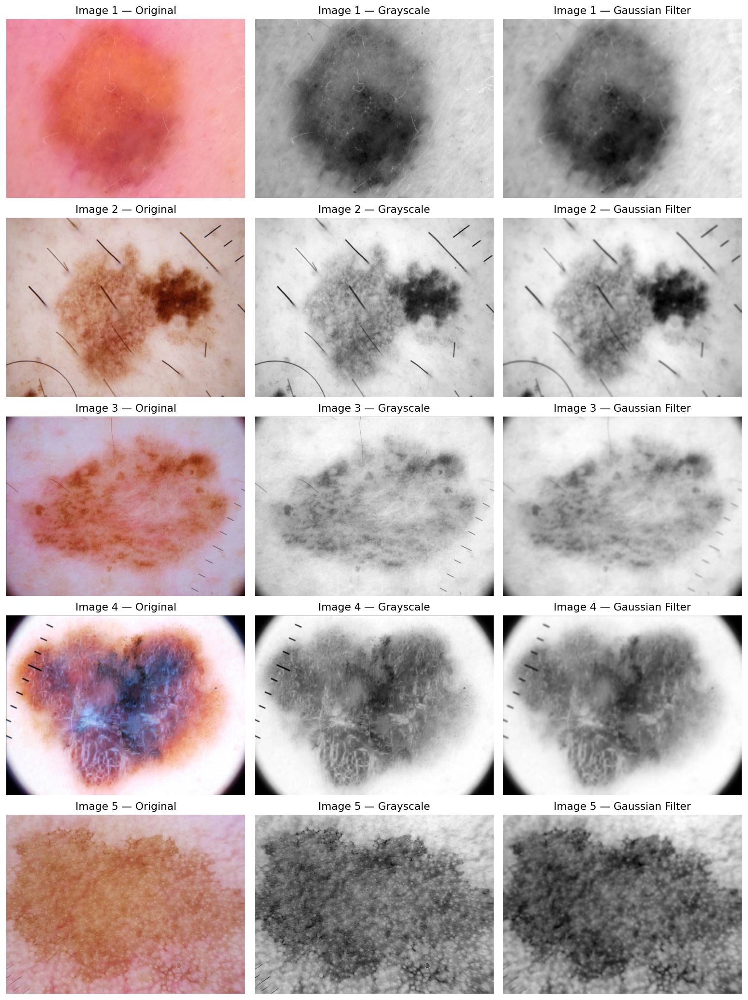
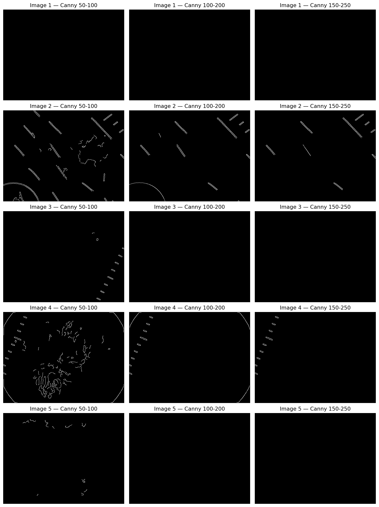
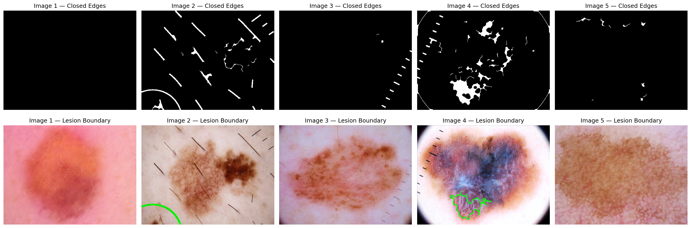
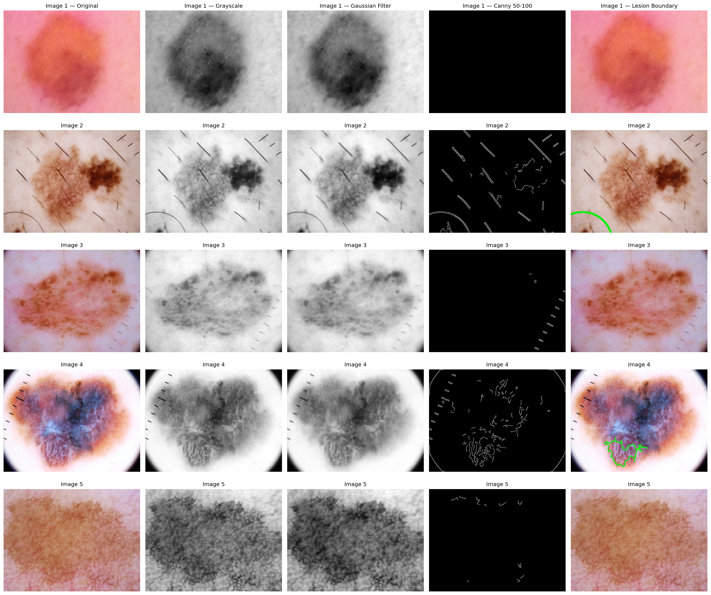
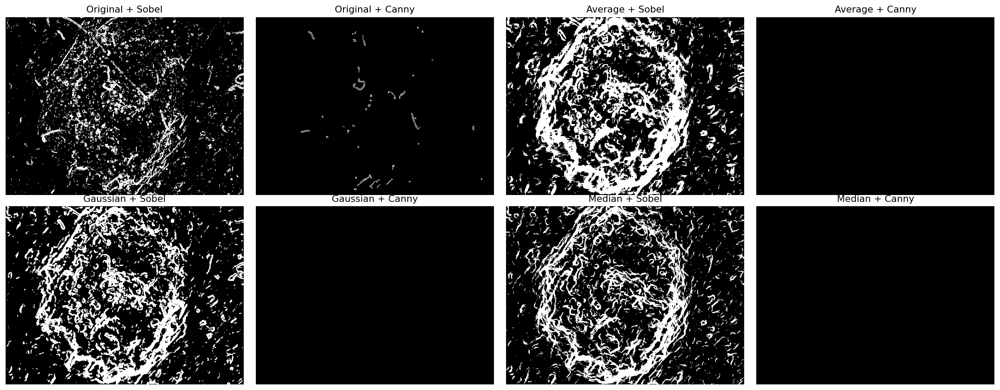

# Lab Assignment: Skin Lesion Boundary Detection Using Canny Edge Detection

**Lab 04 — Computer Vision, Semester 7.** Same series as Lab01, Lab02 and Lab03. The goal is to find the outline of a skin lesion with classical image processing only (grayscale, Gaussian filtering, Canny edge detection, contours), then measure its area and perimeter in pixels and see how well edge detection separates a lesion from the surrounding skin.

> Educational lab work — not a diagnostic tool.

**Dataset:** [HAM10000 (Skin Cancer MNIST)](https://www.kaggle.com/datasets/kmader/skin-cancer-mnist-ham10000)
**Notebook:** [`CV_SkinLesion_BoundaryDetection.ipynb`](./CV_SkinLesion_BoundaryDetection.ipynb)
**Results folder:** [`assets/`](./assets) — figures and CSV tables from the actual run
**Previous labs:** [Lab01](../../Lab01/Skin-Lesion-Classification), [Lab02](../../Lab02/Skin-Lesion-Filtering-Effect), [Lab03](../../Lab03/Skin-Lesion-Edge-Detection)

---

## Problem Statement

Develop a simple computer vision system that detects the boundary of a skin lesion from a skin image using image filtering and Canny edge detection, and determine how effectively edge detection can separate the lesion from the surrounding skin.

## What's in this lab

| Task | What I did |
|---|---|
| 1 | Loaded 5 lesion images from HAM10000 (2 `nv`, 2 `mel`, 1 `bkl`), resized to 512×384 |
| 2 | Converted to grayscale, applied a 7×7 Gaussian filter (σ = 1.5) |
| 3 | Ran Canny with three threshold pairs: 50–100, 100–200, 150–250 |
| 4 | Scored each threshold and picked the best one |
| 5 | Closed gaps in the edge map, took the largest external contour and drew it on the original |
| 6 | Calculated lesion area (pixels inside the contour) and perimeter (contour arc length) |
| Final | Compared Original / Average / Gaussian / Median filtering, each with Sobel and Canny |

## How the results were scored

HAM10000 from Kaggle has no ground-truth lesion masks. For scoring, a rough reference mask was built per image (Gaussian blur → inverse Otsu threshold → morphological clean-up → largest component → holes filled). It is a proxy, not an expert annotation, so the scores are best read as relative comparisons between settings.

- **Edge F1** — how closely edge pixels line up with the reference outline (4 px tolerance)
- **Dice** — overlap between the detected lesion region and the reference mask
- **Noise ratio** — share of edge pixels that belong to tiny isolated fragments (< 30 px)
- **Noise Handling** = 1 − noise ratio, **Edge Quality** = Edge F1, **Boundary Detection** = Dice, **Overall** = mean of the three
- Labels in the final table: High ≥ 0.8, Medium ≥ 0.5, Low below 0.5

---

## Task 1 — Load the Image

Five images were picked from HAM10000 with a fixed random seed. They are shown in the first column of the figures below.

| Image | Class |
|---|---|
| Image 1 | nv |
| Image 2 | nv |
| Image 3 | mel |
| Image 4 | mel |
| Image 5 | bkl |

## Task 2 — Preprocess the Image

Original → Grayscale → Gaussian filter (7×7, σ = 1.5).

## Task 3 — Canny Edge Detection with Three Thresholds

## Task 4 — Select the Best Result

Averages over the 5 images:

| Threshold | Edge Pixels | Edge F1 | Dice | Noise Ratio | Score |
|---|---|---|---|---|---|
| **50–100** | 1561.2 | 0.080 | 0.027 | 0.419 | **0.229** |
| 100–200 | 459.4 | 0.007 | 0.000 | 0.612 | 0.132 |
| 150–250 | 314.4 | 0.008 | 0.000 | 0.615 | 0.131 |

**Selected: 50–100.** It is the only setting that picks up any part of the lesion outline (for example the lower textured part of Image 4 and some pigment-network edges in Image 2). At 100–200 and 150–250 the maps contain almost nothing but hairs, ruler ticks and the dark dermoscope vignette, and the lesion disappears completely. It also has the lowest noise ratio of the three, though none of the three can be called a good result in absolute terms (see the questions below).

## Task 5 — Detect the Lesion Boundary

Edges (50–100) were closed with a morphological closing, the largest external contour was taken, and it was drawn in green on the original.

## Task 6 — Lesion Area and Perimeter

| Image | Best Filter | Edge Method | Area (pixels) | Perimeter (pixels) |
|---|---|---|---|---|
| Image 1 | Gaussian | Canny (50-100) | 0 | 0.0 |
| Image 2 | Gaussian | Canny (50-100) | 893 | 396.33 |
| Image 3 | Gaussian | Canny (50-100) | 0 | 0.0 |
| Image 4 | Gaussian | Canny (50-100) | 6498 | 666.04 |
| Image 5 | Gaussian | Canny (50-100) | 0 | 0.0 |

Reading this table honestly:

- **Images 1, 3, 5:** no closed contour was found, so area and perimeter are 0. These are not real measurements.
- **Image 2:** the contour (893 px) is the circular dermoscope edge in the bottom-left corner, not the lesion.
- **Image 4:** the contour (6498 px) covers only the lower-right textured part of the lesion, so the area is an underestimate.

So none of the five rows is a trustworthy lesion area and perimeter. They are reported as the output of the pipeline exactly as run.

## Required Visualization

Original → Grayscale → Gaussian Filter → Canny → Lesion Boundary

## Final Comparison

Edge maps of all 8 method combinations on Image 1:

Scores averaged over the 5 images (label and value):

| Method | Noise Handling | Edge Quality | Boundary Detection | Overall Performance |
|---|---|---|---|---|
| Original + Sobel | Medium (0.784) | Low (0.155) | Medium (0.730) | Medium (0.556) |
| Original + Canny | Medium (0.609) | Low (0.160) | Low (0.452) | Low (0.407) |
| Average + Sobel | High (0.946) | Low (0.259) | Medium (0.658) | Medium (0.621) |
| Average + Canny | Low (0.299) | Low (0.032) | Low (0.000) | Low (0.110) |
| Gaussian + Sobel | High (0.914) | Low (0.212) | Medium (0.644) | Medium (0.590) |
| Gaussian + Canny | Medium (0.582) | Low (0.080) | Low (0.027) | Low (0.229) |
| Median + Sobel | High (0.885) | Low (0.272) | Medium (0.634) | Medium (0.597) |
| Median + Canny | Medium (0.600) | Low (0.142) | Low (0.041) | Low (0.261) |

Raw numbers are in [`table_final_comparison_scores.csv`](./assets/table_final_comparison_scores.csv).

What the table shows:

- **Sobel scored higher than Canny with every filter.** Sobel responds to gradual intensity changes, which is exactly what these lesion borders are. Canny's thresholds (50 and above) are too strict for them. Part of Sobel's higher Boundary Detection score comes from its thick, messy edge map producing one large blob after closing, so it is a coarse result, not a clean outline.
- **Average + Sobel had the best overall score (0.621),** followed by Median + Sobel (0.597) and Gaussian + Sobel (0.590). The spread between the three is small.
- **Among the Canny variants,** Median + Canny (0.261) and Gaussian + Canny (0.229) did best. Average + Canny returned an almost empty edge map, because heavy blurring lowers the gradient magnitude under the thresholds.
- **Edge Quality is Low everywhere** (best 0.272), so none of the combinations traced the lesion outline cleanly.

---

## Questions

**1. Why is Gaussian filtering applied before Canny detection?**
Canny works on image gradients, and gradients amplify noise. Gaussian smoothing suppresses pixel-level noise, skin texture and fine detail so that only strong, meaningful intensity changes survive the gradient and thresholding steps. Without it, the edge map fills up with tiny false edges. The trade-off, seen in this lab, is that smoothing also weakens real but soft edges.

**2. How did the three Canny threshold settings affect the result?**
Raising the thresholds removed edges steadily: 1561 edge pixels on average at 50–100, 459 at 100–200 and 314 at 150–250. The edges that survived at the higher settings were the sharp, high-contrast structures — hairs, ruler ticks and the dermoscope vignette — while the lesion border vanished. At 50–100 the maps were the busiest (noise ratio 0.419) and contained fragments of the lesion, but they also contained more hair edges. Dice dropped from 0.027 to 0.000 as the thresholds went up.

**3. Which threshold produced the best lesion boundary?**
50–100, with the highest combined score (0.229) and the only non-zero Dice. It is the best of the three given, but it is still not a good boundary: it found the lesion outline only partially in Image 4 and not at all in Images 1, 3 and 5.

**4. Why are edges useful for detecting skin lesions?**
A lesion is usually darker and differently pigmented than the surrounding skin, so it is separated from it by an intensity change. Edges capture that transition directly and reduce the image to an outline, which is what gives the lesion's shape, border irregularity, area and perimeter. Border irregularity is also one of the features used in clinical lesion assessment.

**5. What problems did you observe in detecting the lesion boundary?**
- **Soft, gradual borders.** In Images 1, 3 and 5 the lesion fades into the skin over many pixels. The gradient is small everywhere, so Canny finds no edge at all, even at the lowest setting. This is the main failure.
- **Strong non-lesion edges win.** Hairs (Image 2), ruler ticks (Images 3 and 4) and the dermoscope circle and vignette (Images 2 and 4) have much higher contrast than the lesion, so they dominate the edge map and the largest-contour rule picked them. In Image 2 the "boundary" is the dermoscope circle.
- **Broken edges.** Canny returned short fragments rather than closed loops. Morphological closing joined only some of them, and in Image 4 it produced an outline of only part of the lesion.
- **Textured, multi-colour lesions.** Image 4 contains several colours and internal texture, so edges appear inside the lesion as well as on its border.
- **Reference mask limits.** With no expert masks, Dice and Edge F1 are measured against an Otsu-based proxy, so the numbers are indicative only. The overlays in Task 5 confirm the failures visually.
- **Filter trade-off.** Stronger smoothing (Average) reduced noise but also removed the weak lesion edges, which is why Average + Canny returned an almost empty map.

**6. How could the method be improved?**
- Use much lower Canny thresholds, or compute them automatically from the image (for example from the median intensity), since the suggested 50–250 range is too high for soft lesion borders.
- Remove hair and ruler marks first with black-hat filtering and inpainting, and mask out the dark vignette and dermoscope circle.
- Work on a channel with better lesion contrast (for example the green channel or a Lab colour channel) instead of plain grayscale.
- Choose the contour using position and size (large, near the image centre, not touching the border) instead of just the largest one.
- Combine edges with region-based methods such as Otsu thresholding, watershed or active contours, and for best results use a trained segmentation network such as U-Net.

---

## Conclusion

With the Gaussian + Canny pipeline and the three suggested thresholds, edge detection did not reliably separate the lesion from the surrounding skin on these HAM10000 images. It worked only where the lesion has a sharp border and failed on lesions with soft borders, and it was easily distracted by hair, rulers and the dermoscope frame. Sobel gave a more complete, though noisier and thicker, response across all five images. A usable lesion boundary would need lower or adaptive thresholds, hair removal, and a smarter contour selection step.
