# LAB 05: HOG-Based Industrial Defect Detection and Classification

In this lab I built an automated visual inspection system for steel surfaces. Images are preprocessed, HOG features are extracted, and a machine learning classifier decides whether the product is defective or not. The system then reports ACCEPT or REJECT.

```
Image -> Preprocessing -> HOG Feature Extraction -> Machine Learning Classifier -> Defective / Non-Defective Decision
```

## Files

| File | Description |
|---|---|
| `Lab05_HOG_Defect_Detection.ipynb` | Full notebook (all tasks, experiments, QC module, bonus) |
| `realtime_inspection.py` | Webcam script for the bonus task |
| `assets/` | Figures and result tables generated by the notebook |

## 1. Dataset

I used the NEU Steel Surface Defect dataset (train/valid split version from Kaggle). It has 1800 images of 6 defect types, 300 images per class.

| Class | Train | Valid | Total |
|---|---|---|---|
| crazing | 283 | 17 | 300 |
| inclusion | 283 | 17 | 300 |
| patches | 284 | 16 | 300 |
| pitted_surface | 283 | 17 | 300 |
| rolled-in_scale | 283 | 17 | 300 |
| scratches | 284 | 16 | 300 |
| **All** | **1700** | **100** | **1800** |

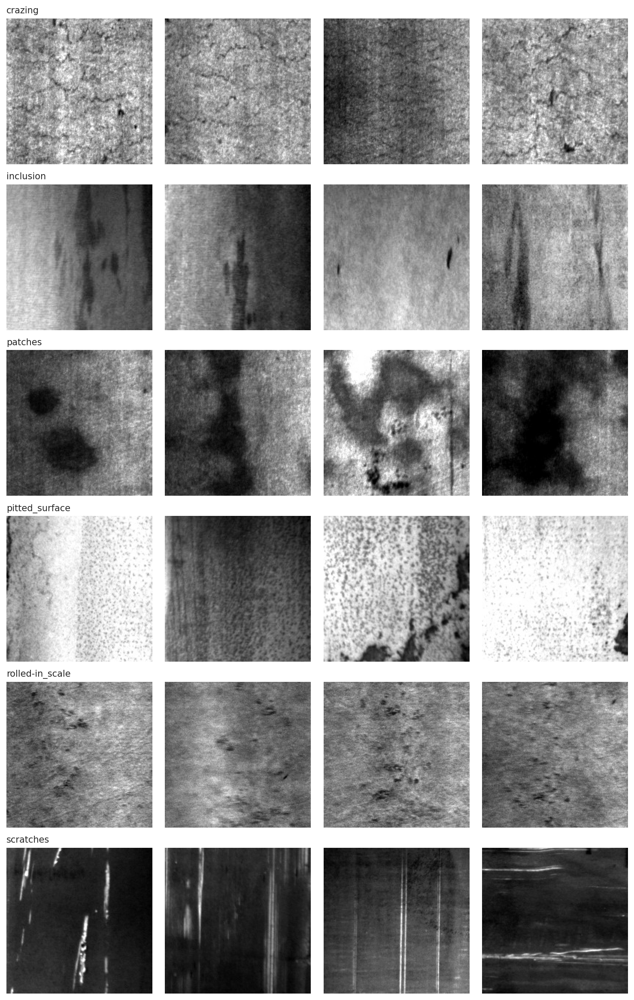

### Binary formulation

NEU-DET has no defect-free class, so I made the Non-Defective class myself:

- **Class 1 (Defective):** 100x100 crop centered on the annotated defect bounding box.
- **Class 0 (Non-Defective):** 100x100 patch from the same image that does not overlap any annotated bounding box.

The original `valid` folder is used as the test set. 20% of the training data is kept as a validation set to choose the HOG parameters.

| | Train | Validation | Test |
|---|---|---|---|
| Non-Defective | 384 | 96 | 27 |
| Defective | 1360 | 340 | 100 |

The classes are imbalanced, so `class_weight='balanced'` is used for SVM and Random Forest.

## 2. Preprocessing

- Image is converted to grayscale.
- Crop is resized to a common resolution of 128x128.

## 3. HOG Feature Extraction

Default settings: 8x8 pixels per cell, 2x2 cells per block, 9 orientations, L2-Hys block normalization. This gives a feature vector of length 8100 per image.

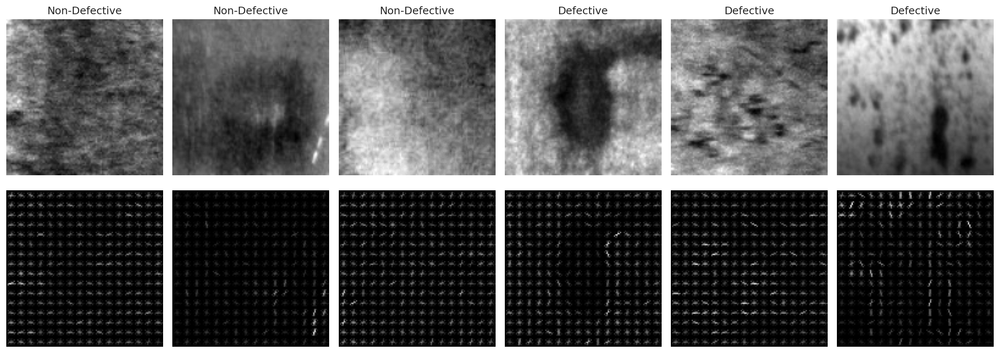

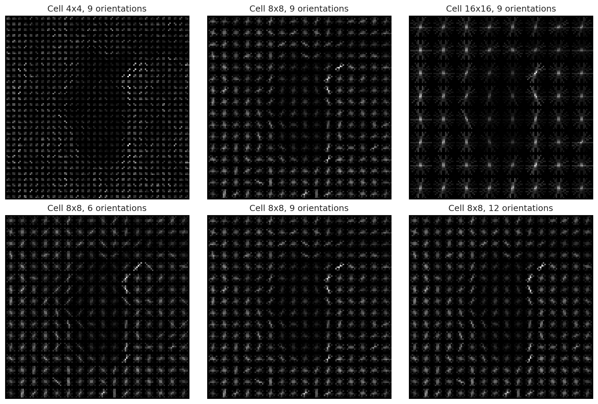

## 4. Classifiers

| Classifier | Settings |
|---|---|
| SVM | RBF kernel, C=10, gamma='scale', balanced class weights |
| Random Forest | 200 trees, balanced class weights |
| KNN | k=5, distance weighting |

## 5. Classifier Comparison (HOG 8x8, 9 orientations, test set)

| Classifier | Accuracy | Precision | Recall | F1-score | Train Time (s) |
|---|---|---|---|---|---|
| HOG + SVM | 0.8661 | 0.8807 | 0.9600 | 0.9187 | 13.31 |
| HOG + Random Forest | 0.8504 | 0.8403 | 1.0000 | 0.9132 | 18.22 |
| HOG + KNN | 0.5039 | 0.9744 | 0.3800 | 0.5468 | 0.20 |

Precision, recall and F1 are for the Defective class.

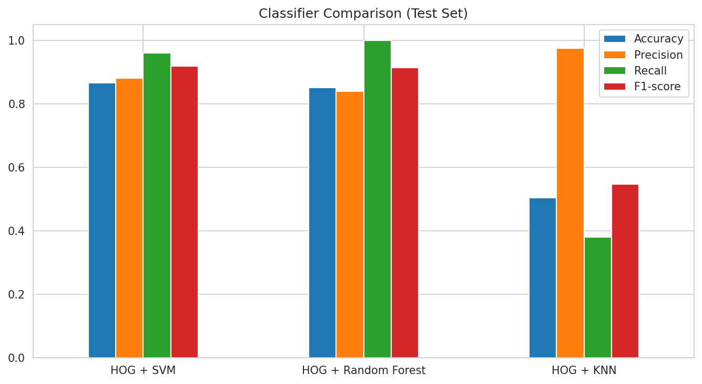

### Confusion matrices

| Classifier | TN | FP | FN | TP |
|---|---|---|---|---|
| HOG + SVM | 14 | 13 | 4 | 96 |
| HOG + Random Forest | 8 | 19 | 0 | 100 |
| HOG + KNN | 26 | 1 | 62 | 38 |

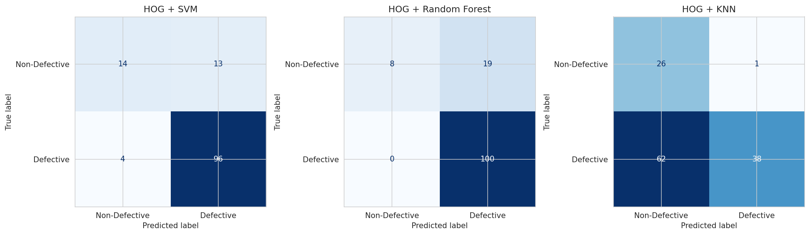

### Classification reports

```
HOG + SVM
               precision    recall  f1-score   support

Non-Defective     0.7778    0.5185    0.6222        27
    Defective     0.8807    0.9600    0.9187       100

     accuracy                         0.8661       127
    macro avg     0.8293    0.7393    0.7704       127
 weighted avg     0.8588    0.8661    0.8556       127

HOG + Random Forest
               precision    recall  f1-score   support

Non-Defective     1.0000    0.2963    0.4571        27
    Defective     0.8403    1.0000    0.9132       100

     accuracy                         0.8504       127
    macro avg     0.9202    0.6481    0.6852       127
 weighted avg     0.8743    0.8504    0.8163       127

HOG + KNN
               precision    recall  f1-score   support

Non-Defective     0.2955    0.9630    0.4522        27
    Defective     0.9744    0.3800    0.5468       100

     accuracy                         0.5039       127
    macro avg     0.6349    0.6715    0.4995       127
 weighted avg     0.8300    0.5039    0.5267       127
```

**Which classifier is better?** SVM gave the best accuracy and F1. Random Forest caught every defective sample (recall 1.0) but accepted most good samples as defective (only 8 of 27 Non-Defective correct). KNN performed worst, it labeled most defective samples as Non-Defective, which is the more dangerous mistake in inspection.

## 6. Effect of HOG Parameters (validation set)

Cell sizes 4x4, 8x8, 16x16 and orientations 6, 9, 12 were compared with SVM and Random Forest.

| Cell | Orientations | Features | SVM Acc | SVM F1 | RF Acc | RF F1 |
|---|---|---|---|---|---|---|
| 4x4 | 6 | 23064 | 0.8372 | 0.9044 | 0.7913 | 0.8820 |
| 4x4 | 9 | 34596 | 0.8211 | 0.8960 | 0.7844 | 0.8786 |
| 4x4 | 12 | 46128 | 0.8257 | 0.8978 | 0.7982 | 0.8854 |
| 8x8 | 6 | 5400 | **0.8647** | **0.9182** | 0.8142 | 0.8936 |
| 8x8 | 9 | 8100 | 0.8486 | 0.9106 | 0.8119 | 0.8924 |
| 8x8 | 12 | 10800 | 0.8601 | 0.9161 | 0.8280 | 0.9007 |
| 16x16 | 6 | 1176 | 0.8532 | 0.9099 | 0.8417 | 0.9074 |
| 16x16 | 9 | 1764 | 0.8509 | 0.9091 | 0.8326 | 0.9031 |
| 16x16 | 12 | 2352 | 0.8509 | 0.9096 | 0.8440 | 0.9091 |

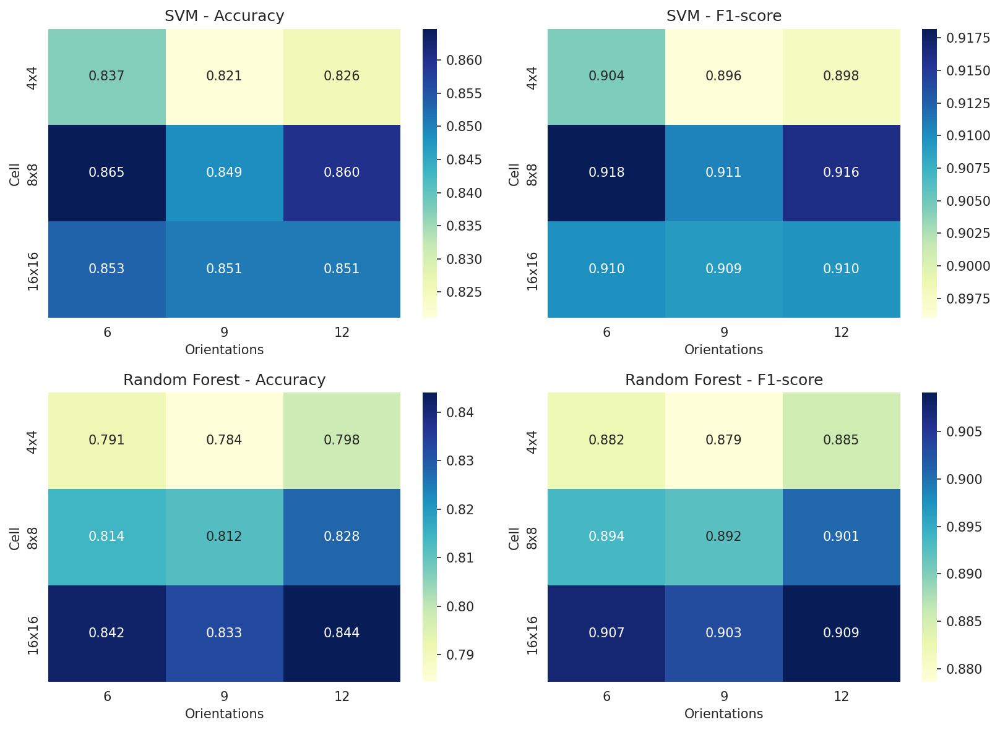

- **Cell size:** 8x8 gave the best SVM results (F1 0.9106 to 0.9182). 4x4 was the worst (F1 0.8960 to 0.9044) and also the slowest, with 23k to 46k features and 47 to 93 seconds of SVM training. 16x16 was close to 8x8 (F1 about 0.909 to 0.910) while training in only 1 to 4.5 seconds.
- **Orientations:** The effect is small. Within one cell size, F1 changes by less than 0.01 for SVM. The best SVM result was 8x8 with 6 orientations.

Best configuration by SVM validation F1: **8x8 cells, 6 orientations**.

## 7. Final Model (8x8, 6 orientations, test set)

| Model | Accuracy | Precision | Recall | F1-score |
|---|---|---|---|---|
| SVM | 0.8583 | 0.8796 | 0.9500 | 0.9135 |
| Random Forest | 0.8425 | 0.8333 | 1.0000 | 0.9091 |

| Model | TN | FP | FN | TP |
|---|---|---|---|---|
| SVM | 14 | 13 | 5 | 95 |
| Random Forest | 7 | 20 | 0 | 100 |

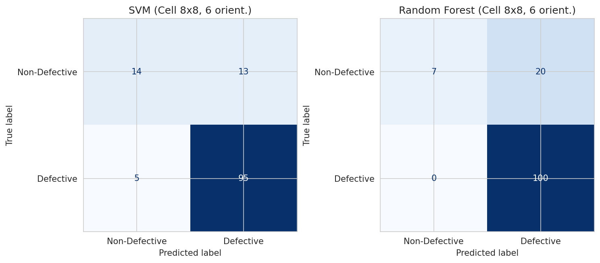

```
FINAL SVM
               precision    recall  f1-score   support

Non-Defective     0.7368    0.5185    0.6087        27
    Defective     0.8796    0.9500    0.9135       100

     accuracy                         0.8583       127
    macro avg     0.8082    0.7343    0.7611       127
 weighted avg     0.8493    0.8583    0.8487       127

FINAL Random Forest
               precision    recall  f1-score   support

Non-Defective     1.0000    0.2593    0.4118        27
    Defective     0.8333    1.0000    0.9091       100

     accuracy                         0.8425       127
    macro avg     0.9167    0.6296    0.6604       127
 weighted avg     0.8688    0.8425    0.8034       127
```

The final SVM scored slightly lower on the test set than the default 9 orientation SVM (0.8583 vs 0.8661 accuracy). The difference is small, and the test set has only 127 samples.

## 8. Robustness Analysis

The final SVM and Random Forest were tested on the test set after changing the images. The models were not retrained.

| Condition | SVM Acc | SVM F1 | SVM Acc change | SVM F1 change | RF Acc | RF F1 | RF Acc change | RF F1 change |
|---|---|---|---|---|---|---|---|---|
| Original | 0.8583 | 0.9135 | 0 | 0 | 0.8425 | 0.9091 | 0 | 0 |
| Brightness x0.6 | 0.8346 | 0.8912 | -0.0236 | -0.0223 | 0.8898 | 0.9346 | +0.0472 | +0.0255 |
| Brightness x1.5 | 0.8583 | 0.9135 | 0 | 0 | 0.8583 | 0.9174 | +0.0157 | +0.0083 |
| Gaussian noise (std 10) | 0.7008 | 0.8224 | -0.1575 | -0.0910 | 0.7874 | 0.8811 | -0.0551 | -0.0280 |
| Gaussian noise (std 25) | 0.7717 | 0.8700 | -0.0866 | -0.0435 | 0.7795 | 0.8761 | -0.0630 | -0.0330 |
| Blur (kernel 5) | 0.8110 | 0.8929 | -0.0472 | -0.0206 | 0.7874 | 0.8811 | -0.0551 | -0.0280 |
| Blur (kernel 9) | 0.7874 | 0.8811 | -0.0709 | -0.0324 | 0.7874 | 0.8811 | -0.0551 | -0.0280 |
| Rotation 10 deg | 0.8898 | 0.9346 | +0.0315 | +0.0211 | 0.8661 | 0.9217 | +0.0236 | +0.0126 |
| Rotation 30 deg | 0.8976 | 0.9378 | +0.0394 | +0.0243 | 0.8740 | 0.9259 | +0.0315 | +0.0168 |

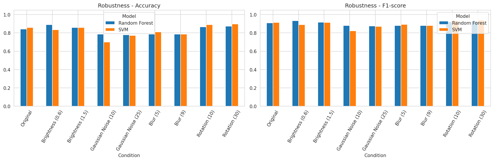

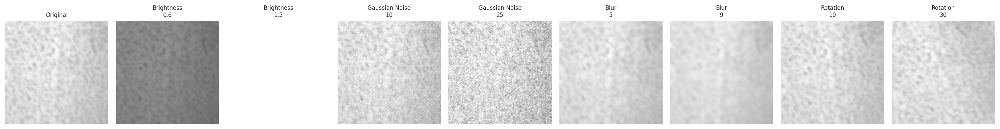

- **Noise** hurt the SVM the most. At std 10 its accuracy dropped from 0.8583 to 0.7008 and F1 from 0.9135 to 0.8224. Random Forest dropped less (0.0551 accuracy). The SVM drop at std 25 was smaller than at std 10, I did not investigate why.
- **Blur** reduced accuracy by 0.047 to 0.071 for SVM and 0.055 for Random Forest.
- **Brightness** had little effect on SVM (no change at x1.5, small drop at x0.6). HOG block normalization reduces the effect of brightness changes.
- **Rotation** did not reduce performance, accuracy went up for both models. A likely reason is that the rotated images are predicted as Defective more often, and 100 of the 127 test samples are Defective.

## 9. Multi-Class Defect Classification (advanced)

All 6 defect types were classified on the full images (train: 1700, test: 100) using HOG 8x8 with 6 orientations.

| Model | Accuracy | Precision (macro) | Recall (macro) | F1 (macro) |
|---|---|---|---|---|
| SVM | 0.8900 | 0.8913 | 0.8909 | 0.8864 |
| Random Forest | 0.7900 | 0.8098 | 0.7886 | 0.7887 |

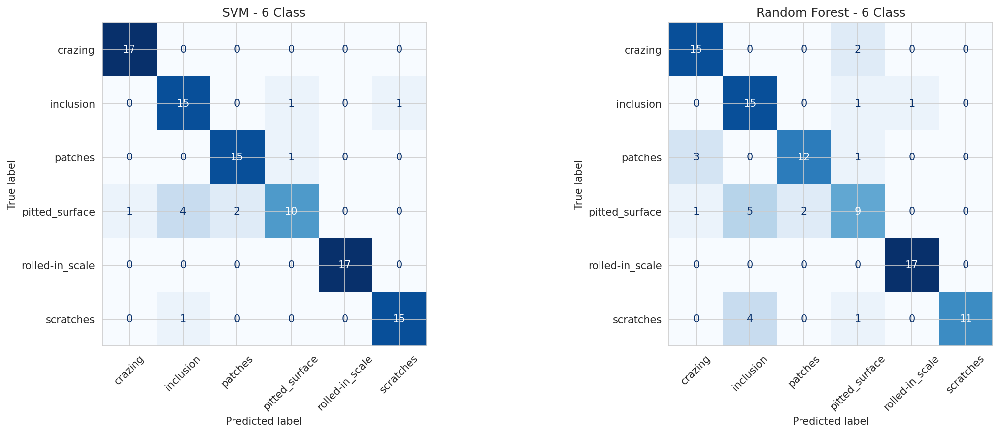

```
MULTI-CLASS SVM
                 precision    recall  f1-score   support

        crazing     0.9444    1.0000    0.9714        17
      inclusion     0.7500    0.8824    0.8108        17
        patches     0.8824    0.9375    0.9091        16
 pitted_surface     0.8333    0.5882    0.6897        17
rolled-in_scale     1.0000    1.0000    1.0000        17
      scratches     0.9375    0.9375    0.9375        16

       accuracy                         0.8900       100
      macro avg     0.8913    0.8909    0.8864       100
   weighted avg     0.8909    0.8900    0.8857       100

MULTI-CLASS Random Forest
                 precision    recall  f1-score   support

        crazing     0.7895    0.8824    0.8333        17
      inclusion     0.6250    0.8824    0.7317        17
        patches     0.8571    0.7500    0.8000        16
 pitted_surface     0.6429    0.5294    0.5806        17
rolled-in_scale     0.9444    1.0000    0.9714        17
      scratches     1.0000    0.6875    0.8148        16
```

SVM was better than Random Forest by 10 points of accuracy. Rolled-in scale was classified perfectly by SVM, while pitted_surface was the hardest class for both models.

## 10. Quality-Control Decision Module

`inspect_product(img)` runs the full pipeline on one image and prints the inspection result using the final SVM. A product is rejected when the predicted probability of Defective is 0.5 or more.

```
PRODUCT INSPECTION RESULT
Prediction: DEFECTIVE / NON-DEFECTIVE
Confidence: XX.X%
Action: REJECT PRODUCT / ACCEPT PRODUCT
```

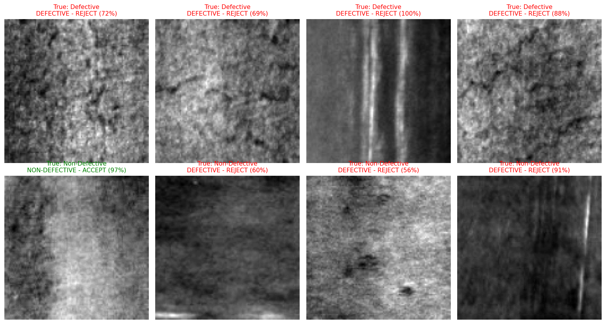

On these 8 test samples, all 4 defective samples were rejected correctly. Of the 4 non-defective samples, 1 was accepted and 3 were wrongly rejected.

## 11. Bonus: Real-Time Prototype

`realtime_inspection.py` reads frames from the webcam, takes the center square, extracts HOG features and shows PASS or DEFECTIVE with the confidence and FPS on the video. Press `q` to quit.

To test the same logic without a camera, the notebook runs it on a simulated stream of 24 test images (400x400) and saves the annotated video. The average processing time was 18.2 ms per frame (55.0 FPS) on Colab.

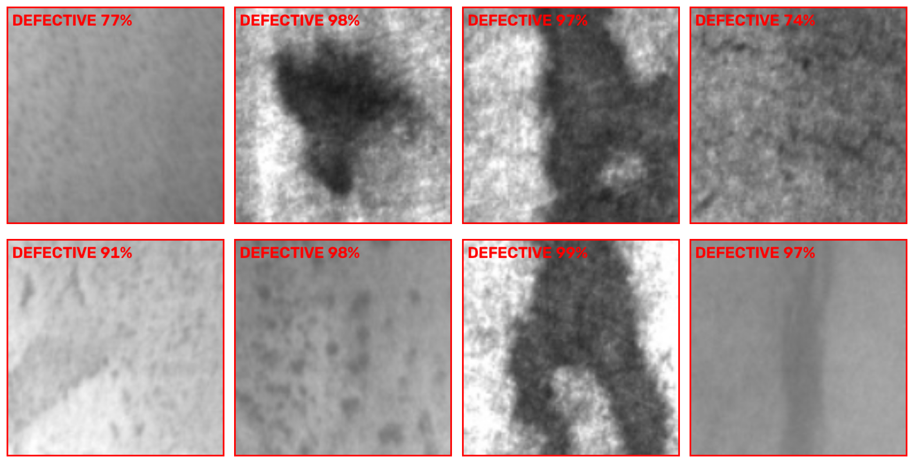

Video: [assets/bonus_stream.mp4](assets/bonus_stream.mp4)

## 12. Industrial Deployment Discussion

The SVM missed only 5 of 100 defective samples, and the pipeline is fast enough for a live production line (18.2 ms per frame on CPU). Because HOG is a fixed hand-crafted feature, the system needs no GPU and is easy to retrain on new defect types. The main problem is false rejects, 13 of 27 good samples were rejected, which would waste good product. The reject threshold can be changed depending on whether missing a defect or rejecting a good product costs more. For real use, the camera, lighting and distance should be fixed, since noise and blur reduced accuracy in the robustness test.

## 13. Limitations

- The dataset has no real defect-free images. The Non-Defective class is made from patches outside the annotated boxes, and some of them show dark spots or marks that were not annotated (visible in the rejected samples in the QC figure), so the labels are not fully clean.
- The test set has only 27 Non-Defective samples, so the Non-Defective metrics change a lot with a few samples.
- Results are from a single train/validation/test split and a single run.
- The webcam script only gives meaningful predictions on steel surface images like the training data.

## 14. Conclusion

HOG features with an SVM classifier gave the best result in this lab: 0.8661 accuracy and 0.9187 F1 for defective vs non-defective, and 0.89 accuracy for 6-class classification. An 8x8 cell size was the best trade-off, 4x4 was slow with no gain and number of orientations made little difference. Noise and blur reduced accuracy, while brightness and rotation did not. The system works as a quality-control prototype, but the number of good products wrongly rejected needs to be reduced before real use.

## How to Run

1. Open `Lab05_HOG_Defect_Detection.ipynb` in Google Colab and run all cells. The dataset is downloaded with `kagglehub` and the figures are saved in `figures/`.
2. For the webcam demo, run `python realtime_inspection.py` in the folder that contains the saved model `hog_svm_model.joblib`.
